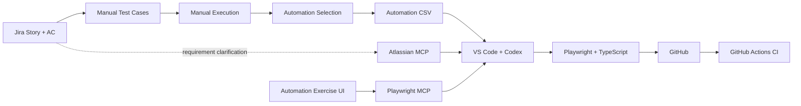

# Automation Exercise QA Portfolio


A personal **QA / Test Automation portfolio project** built against [Automation Exercise](https://www.automationexercise.com/).

The project demonstrates a full QA workflow:

**Simulated Jira requirements → Manual test design & execution → Automation prioritization → Playwright UI/API automation → AI-assisted implementation with Codex + MCP → GitHub Actions CI**

> **Project status:** Complete — manual execution, automation implementation, and CI are in place.

---

## Project Goals

This project was created to demonstrate practical QA skills across the testing lifecycle:

- Requirement analysis using a simulated Jira backlog
- Acceptance Criteria traceability
- Manual test case design and execution
- Positive, negative, validation, regression, E2E, navigation, and API testing
- Risk/value-based automation prioritization
- Playwright + TypeScript automation
- Page Object Model and reusable test data
- Cross-browser testing
- API automation with Playwright
- AI-assisted test engineering using Codex and MCP
- GitHub Actions continuous integration
- Secure handling of test credentials and CI secrets

---

## System Under Test

**Website:** [https://www.automationexercise.com/](https://www.automationexercise.com/)

Automation Exercise is a public practice website for QA and automation testing.

Public scenarios used as a testing reference:

- [UI Test Cases](https://www.automationexercise.com/test_cases)
- [API List](https://www.automationexercise.com/api_list)

The Jira backlog used in this repository is a **simulated portfolio requirements layer** derived from the public application behavior and public test/API scenarios.

---

## Test Coverage Summary

| Epic      | Scope                               | Manual Cases | Automated Cases |
| --------- | ----------------------------------- | -----------: | --------------: |
| AEQA-1    | Authentication & Account Management |           13 |              13 |
| AEQA-2    | Product Catalog & Discovery         |           14 |              14 |
| AEQA-3    | Shopping Cart Management            |            8 |               8 |
| AEQA-4    | Checkout & Order Management         |            8 |               8 |
| AEQA-5    | Customer Engagement & Support       |            6 |               6 |
| AEQA-6    | Navigation & UI Behavior            |            5 |               2 |
| AEQA-7    | API Testing                         |           14 |              14 |
| **Total** |                                     |       **68** |          **65** |

Three low-value/manual UI behavior cases were intentionally kept as **manual-only**.

### Latest Manual Execution

| Status    |  Count |
| --------- | -----: |
| Pass      |     68 |
| Fail      |      0 |
| Blocked   |      0 |
| **Total** | **68** |

---

## Automation Prioritization

Automation candidates were prioritized before implementation:

| Auto Priority | Cases | Meaning                                                    |
| ------------- | ----: | ---------------------------------------------------------- |
| P1            |    29 | Core/high-value automation implemented first               |
| P2            |     8 | Secondary automation implemented after P1                  |
| P3            |    28 | Lower-priority automation implemented after the main scope |
| Manual only   |     3 | Intentionally not automated                                |

Priority controls **implementation order**, not how code is organized.

Spec files and Page Objects are organized by **business feature**, not by P1/P2/P3.

---

## Test Case Traceability

The manual suite keeps traceability between requirements, test design, and automation.

Important fields include:

- **Story ID** — related Jira Story
- **AC Ref** — Acceptance Criteria covered by the test
- **Source Case** — related public Automation Exercise test/API scenario
- **Automation Candidate** — Yes / Later / No
- **Auto Priority** — P1 / P2 / P3

`AC Ref = Derived` is used when a QA scenario is inferred from the feature or form constraints rather than explicitly stated in an Acceptance Criterion.

Examples include empty-field validation and additional negative scenarios.

---

## Test Artifacts

The repository keeps manual and automation-source artifacts under `docs/`.

Typical structure:

```text
docs/
├── manual-testing/
│   └── AEQA_Manual_Test_Suite.xlsx
└── test-cases/
    └── AEQA_Automation_Test_Cases.csv
```

### Manual Test Suite

The Excel workbook contains:

- 68 manual test cases
- Story / AC traceability
- Preconditions
- Test steps
- Test data
- Expected and actual results
- Execution status
- Priority
- Test type
- Automation candidate and priority
- Bug ID / Evidence fields
- Reusable test data in `99_Test_Data`

### Automation CSV

The CSV contains the automation-target test cases in a simple format that can be read easily by coding agents and automation tooling.

---

## Tech Stack

| Area                   | Tool                               |
| ---------------------- | ---------------------------------- |
| Manual Test Management | Excel                              |
| Requirement Management | Jira (simulated portfolio backlog) |
| UI Automation          | Playwright                         |
| API Automation         | Playwright APIRequestContext       |
| Language               | TypeScript                         |
| IDE                    | Visual Studio Code                 |
| AI Agent               | OpenAI Codex                       |
| Jira Integration       | Atlassian MCP                      |
| Browser Inspection     | Playwright MCP                     |
| Source Control         | Git / GitHub                       |
| CI                     | GitHub Actions                     |
| Reporting              | Playwright HTML Report             |

---

## AI-Assisted QA Workflow

AI is used as an engineering assistant, while test scope, expected behavior, review, and final decisions remain tester-controlled.



### How Codex + MCP are used

- Codex reads the local automation CSV and existing repository code.
- Atlassian MCP is used when a Jira Story or Acceptance Criterion needs clarification.
- Playwright MCP is used when the current UI, behavior, or locator needs inspection.
- Jira is not modified automatically unless explicitly requested.
- Existing Page Objects and reusable test utilities are preferred over duplicated code.
- Generated code is reviewed and executed before it is accepted.

---

## Project Structure

The project is organized by business feature rather than automation priority.

```text
automation-exercise-qa/
├── .github/
│   └── workflows/
│
├── docs/
│   ├── manual-testing/
│   └── test-cases/
│
├── pages/
│   ├── <feature>/
│   └── common/
│
├── test-data/
│
├── tests/
│   ├── auth/
│   ├── products/
│   ├── cart/
│   ├── checkout/
│   ├── support/
│   ├── navigation/
│   └── api/
│
├── .env.example
├── .gitignore
├── AGENTS.md
├── playwright.config.ts
├── package.json
└── package-lock.json
```

### Structure Rules

- `tests/<feature>/` contains test specifications.
- `pages/<feature>/` contains feature-specific Page Objects.
- `pages/common/` contains reusable site-wide components.
- `test-data/` contains reusable test data and data generators.
- Each manual test case remains traceable through its Test Case ID in the automated test title.
- Shared actions and locators are reused instead of duplicated.

---

## Automation Design

### Page Object Model

UI locators and reusable page actions are separated from test logic.

Example:

```text
pages/auth/
├── AccountInformationPage.ts
├── AccountResultPage.ts
└── SignupLoginPage.ts

pages/common/
└── SiteHeader.ts
```

Tests focus on the scenario and assertions, while Page Objects handle UI interaction.

### Test Independence

Automation is designed so that tests can run independently where possible.

For destructive account scenarios, disposable test accounts are created instead of deleting the shared login account.

### Test Data

Reusable data is separated from test logic.

Sensitive values such as login credentials are stored in environment variables rather than hardcoded in source code.

---

## Environment Setup

### Prerequisites

- Node.js 20+
- npm
- Git

Clone the repository:

```bash
git clone https://github.com/nhuhaudev/automation-exercise-qa.git
cd automation-exercise-qa
```

Install dependencies:

```bash
npm ci
```

Install Playwright browsers:

```bash
npx playwright install
```

Create the local environment file:

```bash
cp .env.example .env
```

Add your test credentials:

```env
TEST_EMAIL=your_test_account@example.com
TEST_PASSWORD=your_test_password
```

> `.env` is ignored by Git and must not be committed.

---

## Running Tests

### Run the full configured suite

```bash
npx playwright test
```

### Run with visible browsers

```bash
npx playwright test --headed
```

### Run the full suite on Chromium only

```bash
npx playwright test --project=chromium
```

### Run one feature

Example — Authentication:

```bash
npx playwright test tests/auth --project=chromium
```

### Run one spec file

```bash
npx playwright test tests/auth/login.spec.ts --headed
```

### Run a specific Test Case ID

```bash
npx playwright test --grep "TC-AUTH-006" --headed
```

### Open the HTML report

```bash
npx playwright show-report
```

---

## Cross-Browser Testing

The Playwright configuration supports:

- Chromium
- Firefox
- WebKit

A full local run can execute the test suite across all configured browser projects.

For normal development and CI, Chromium is used as the primary browser to keep feedback faster and reduce load on the public shared test environment.

---

## Continuous Integration

GitHub Actions is configured to run Playwright automatically on:

- Pushes to `main`
- Pull requests targeting `main`

The current CI strategy:

```text
Checkout repository
        ↓
Setup Node.js
        ↓
npm ci
        ↓
Install Chromium + system dependencies
        ↓
Run the discovered Playwright suite
on Chromium with 1 worker
        ↓
Upload Playwright HTML report artifact
```

The CI run intentionally uses:

```text
Chromium
workers = 1
```

because Automation Exercise is a shared public testing site and may occasionally return a **queue full / heavy load** page when too many browser sessions hit it concurrently.

The Playwright HTML report is uploaded as a GitHub Actions artifact for later review.

> This repository focuses on **CI**, not CD, because the application under test is an external public website and is not deployed by this project.

---

## Reliability Considerations

Because the System Under Test is a public shared environment:

- The site can occasionally be unavailable or under heavy load.
- Tests avoid unnecessary parallel pressure in CI.
- CI uses a single worker for stability.
- Retries can be used for temporary environment failures.
- A failure is reviewed before changing automation logic.
- Environment failures are distinguished from functional product failures.

An example encountered during testing was:

```text
This website is under heavy load (queue full)
```

The same test passed when rerun after the public site recovered, confirming that the failure came from environment availability rather than the functional scenario.

---

## Security & Test Data

- `.env` is excluded from Git.
- `.env.example` documents required environment variables without exposing values.
- GitHub Actions uses repository secrets such as `TEST_EMAIL` and `TEST_PASSWORD`.
- Real personal information and real payment information are not used.
- Disposable accounts are used for create/delete account scenarios where appropriate.

---

## QA Workflow Demonstrated

```text
1. Analyze Story + Acceptance Criteria
2. Design manual test cases
3. Prepare reusable test data
4. Execute manual testing
5. Record Actual Result / Status / Evidence
6. Review failures before logging bugs
7. Select automation candidates
8. Implement P1 → P2 → P3
9. Organize code by business feature
10. Review and run automated tests
11. Commit and push to GitHub
12. GitHub Actions runs CI
```

---

## Key Takeaways

This project demonstrates that I can:

- Build traceable test coverage from requirements
- Design and execute structured manual test cases
- Identify positive, negative, validation, and E2E scenarios
- Decide what should and should not be automated
- Build maintainable Playwright + TypeScript automation
- Apply Page Object Model and reusable test-data patterns
- Automate both UI and REST API scenarios
- Work with test dependencies and disposable data safely
- Debug flaky/environment-related failures
- Run cross-browser automation
- Use Codex and MCP as part of a controlled QA workflow
- Integrate automated testing into GitHub Actions CI
- Maintain a Git-based QA automation project suitable for team review

---

## Disclaimer

This is a **personal QA portfolio project**.

The Jira requirements/backlog are simulated for portfolio purposes and are based on the publicly available Automation Exercise website, public test scenarios, and public API scenarios.

This repository is not affiliated with or maintained by Automation Exercise.

---

## Repository

**GitHub:** [nhuhaudev/automation-exercise-qa](https://github.com/nhuhaudev/automation-exercise-qa)
